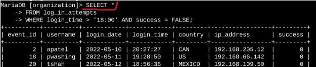
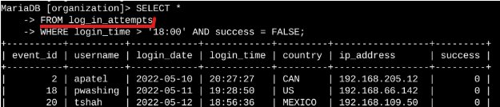
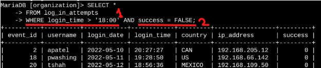
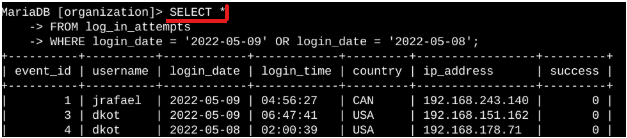
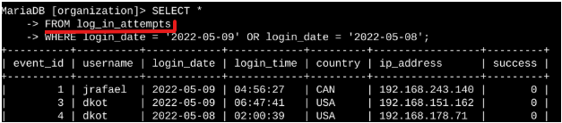
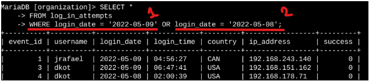
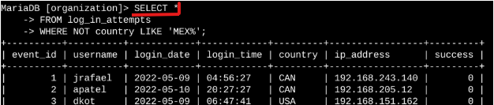
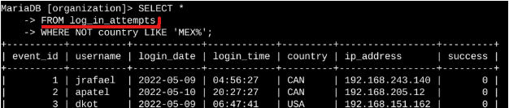
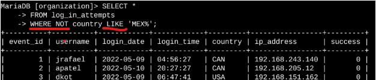

# Apply-filters-to-SQL-queries
**Platform:** Google Cybersecurity Courses On Coursera | **Type:** Practical Scenario with Hands-On Lab  
## Project description
My organization is working to make their system more secure. It is my job to ensure the system is safe, investigate all potential security issues, and update employee computers as needed. The following steps provide examples of how I used SQL with filters to perform security-related tasks.
## Retrieve after hours failed login attempts
There was a potential security incident that occurred after business hours (after 18:00). All after hours login attempts that failed need to be investigated.
The following code demonstrates how I created a SQL query to filter for failed login attempts that occurred after business hours. 

The first part of the screenshot is my query, and the second part is a portion of the output. This query filters for failed login attempts that occurred after 18:00.
First, I started by selecting all data from the <b>`log_in_attempts`</b> table.
  

 
Then, I used a <b>`WHERE`</b> clause with an <b>`AND`</b> operator to filter my results to output only login attempts that occurred after 18:00 and were unsuccessful. 

  

 
The first condition is <b>`login_time > '18:00'`</b>, which filters for the login attempts that occurred after 18:00. The second condition is <b>`success = FALSE`</b>, which filters for the failed login attempts. 

  

 
   
## Retrieve login attempts on specific dates
A suspicious event occurred on 2022-05-09. Any login activity that happened on 2022-05-09 or on the day before needs to be investigated.
The following code demonstrates how I created a SQL query to filter for login attempts that occurred on specific dates.

The first part of the screenshot is my query, and the second part is a portion of the output. This query returns all login attempts that occurred on 2022-05-09 or 2022-05-08.First, I started by selecting all data from the `log_in_attempts` table. 
  

 

Then, I used a `WHERE` clause with an `OR` operator to filter my results to output only login attempts that occurred on either 2022-05-09 or 2022-05-08.
  

 

The first condition is `login_date = '2022-05-09'`, which filters for logins on 2022-05-09. The second condition is `login_date = '2022-05-08'`, which filters for logins on 2022-05-08.
  

 

## Retrieve login attempts outside of Mexico
After investigating the organization’s data on login attempts, I believe there is an issue with the login attempts that occurred outside of Mexico. These login attempts should be investigated.
The following code demonstrates how I created a SQL query to filter for login attempts that occurred outside of Mexico. 

The first part of the screenshot is my query, and the second part is a portion of the output. This query returns all login attempts that occurred in countries other than Mexico. First, I started by selecting all data from the `log_in_attempts` table. 
  

 

Then, I used a `WHERE` clause with `NOT` to filter for countries other than Mexico.
  

 

   I used `LIKE` with `MEX%` as the pattern to match because the dataset represents Mexico as `MEX` and `MEXICO`. The percentage sign `(%)` represents any number of unspecified characters when used with `LIKE`. 
  

 

## Retrieve employees in Marketing
My team wants to update the computers for certain employees in the Marketing department. To do this, I have to get information on which employee machines to update.
The following code demonstrates how I created a SQL query to filter for employee machines from employees in the Marketing department in the East building.

**Screenshot 4**

The first part of the screenshot is my query, and the second part is a portion of the output. This query returns all employees in the Marketing department in the East building. First, I started by selecting all data from the `employees` table. Then, I used a `WHERE` clause with `AND` to filter for employees who work in the Marketing department and in the East building. I used `LIKE` with `East%` as the pattern to match because the data in the `office` column represents the East building with the specific office number. The first condition is the `department = 'Marketing'` portion, which filters for employees in the Marketing department. The second condition is the `office LIKE 'East%'` portion, which filters for employees in the East building.

## Retrieve employees in Finance or Sales
The machines for employees in the Finance and Sales departments also need to be updated. Since a different security update is needed, I have to get information on employees only from these two departments.
The following code demonstrates how I created a SQL query to filter for employee machines from employees in the Finance or Sales departments.

**Screenshot 5**

The first part of the screenshot is my query, and the second part is a portion of the output. This query returns all employees in the Finance and Sales departments. First, I started by selecting all data from the `employees` table. Then, I used a `WHERE` clause with `OR` to filter for employees who are in the Finance and Sales departments. I used the `OR` operator instead of `AND` because I want all employees who are in either department. The first condition is `department = 'Finance'`, which filters for employees from the Finance department. The second condition is `department = 'Sales'`, which filters for employees from the Sales department.

## Retrieve all employees not in IT
My team needs to make one more security update on employees who are not in the Information Technology department. To make the update, I first have to get information on these employees.
The following demonstrates how I created a SQL query to filter for employee machines from employees not in the  Information Technology department.

**Screenshot 6**

The first part of the screenshot is my query, and the second part is a portion of the output. The query returns all employees not in the Information Technology department. First, I started by selecting all data from the `employees` table. Then, I used a `WHERE` clause with `NOT` to filter for employees not in this department.

## Summary
I applied filters to SQL queries to get specific information on login attempts and employee machines. I used two different tables, `log_in_attempts` and `employees`. I used the `AND`, `OR`, and `NOT` operators to filter for the specific information needed for each task. I also used `LIKE` and the percentage sign `(%)` wildcard to filter for patterns.

